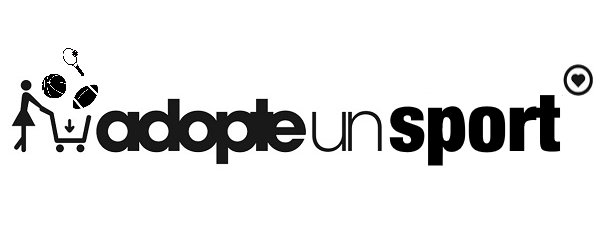

# ADOPTE UN SPORT

    

## Table des matières 

- [ADOPTE UN SPORT](#adopte-un-sport)
  - [Table des matières](#table-des-matières)
  - [Introduction](#introduction)
  - [Présentation du projet](#présentation-du-projet)
  - [Installation en local](#installation-en-local)
  - [Dépendances](#dépendances)
  - [Accéder au site](#accéder-au-site)
  - [Licence](#licence)
  - [Auteurs](#auteurs)

## Introduction

Le projet a été réalisé dans le cadre de l'enseignement "MIF10 Projet transversal" du [master 1 informatique](http://master-info.univ-lyon1.fr/M1/) de [l'université Claude Bernard Lyon 1](https://www.univ-lyon1.fr/). Le développement s'est déroulé en 5 semaines, entre le *23/09/2020* et  le *27/11/2020*. Il a été développé par 6 étudiants, suivant le modèle *AGILE*, 100% à distance dû aux contraintes sanitaires.  
  
Pour plus d'informations, voir le [Wiki](https://forge.univ-lyon1.fr/p1703733/m1if10-projet-transversal/-/wikis/home) du projet.

## Présentation du projet 

*Adopte un sport* est un site web permettant de mettre en relation des personnes autour d'évènements sportifs. À défaut d'adopter un mec, le site offre la possibilité de participer à des évènements organisés par d'autres membres, ou alors d'en créer un, à condition d'avoir un compte sur le site. Votre excuse pour ne pas faire de sport ? 

# Installation en local

Pour des informations détaillées, voir : [ici](https://forge.univ-lyon1.fr/p1703733/m1if10-projet-transversal/-/wikis/Travail-sur-un-serveur-local)  

#### Prérequis
- Java 11 avec la variable d'envrionnement HOME déclarée
- Maven 
- Tomcat 9
- PostgreSQL
- [Optionnel] SonarQube

#### Setup

1. `git clone https://forge.univ-lyon1.fr/p1703733/m1if10-projet-transversal.git`
2. `cd m1if10-projet-transversal && cd AdopteUnSport`
3. `cp src/main/resources/META-INF/persistence.xml.example src/main/resources/META-INF/persistence.xml`
4. Remplacez les proprietés `url`, `user` et `password` avec les valeurs correspondantes à vos bases de données PSQL
5. `mvn install`

#### Compilation

- `mvn clean package`
- Sans les tests : `mvn clean package -Dmaven.test.skip\=true`

#### Déploiement

- Plusieurs possibilités : 
  - Copier le fichier `.war` généré dans le répertoire `webapps` de votre Tomcat puis lancer le serveur manuellement 
  - Utiliser un plugin de votre IDE pour le faire automatiquement
  - Configurer le plugin [tomcat7](https://www.baeldung.com/tomcat-deploy-war) et les goals Maven pour le déploiement (`mvn tomcat7:deploy` et `mvn tomcat7:redeploy`)
  

## Dépendences

- Tomcat 9 : serveur
- Maven : outil de gestion du projet
- PostgreSQL : Système de gestion de base de données relationnelle et objet
- Hibernate validator : validation des contraintes sur les entités
- Eclipselink : implémentation de Java Persistence API (JPA)
- Junit : tests untaires
- JBCrypt : hachage des mots de passe
- Java JWT : gestion de l'authentification avec un JSON Web Token (JWT)
- SonarQube + Jacoco : qualité et sécurité du code
- Plugin Checkstyle : Pour un max de style
- Bootstrap 4 : Frontend framework
- JQuery : Librairie Javascript
  

  
## Accéder au site

Le site est accessible via le lien suivant : [Adopte un sport](http://192.168.74.199:8080/adopteunsport/)

## Licence

Ce projet est libre d'utilisation, en respectant les règles suivantes :
- Toutes les sources originales doivent être citées
- Toute utilisation commerciale est interdite
  

## Auteurs

- [BROGLIATO Lucas](https://forge.univ-lyon1.fr/p1703733)
- [CHERMITTI Yanis](https://forge.univ-lyon1.fr/p1601402)
- [GOUPY Gaspard](https://forge.univ-lyon1.fr/p1708658)
- [ICMEN Malik](https://forge.univ-lyon1.fr/p1704010)
- [KNOCKAERT Titouan](https://forge.univ-lyon1.fr/p2004365)
- [PERRET Louis](https://forge.univ-lyon1.fr/p1700063)

